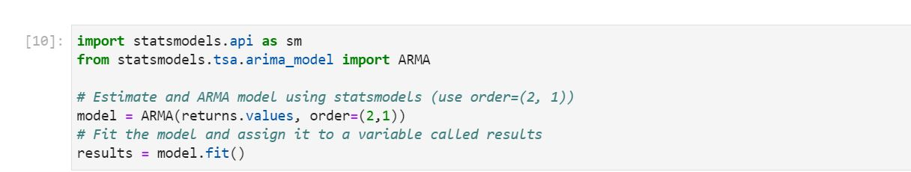

# Yen_Futures_Regression

This project is made up of two parts.

Part 1 is a time-series analysis of yen futures settle prices.  It utilizes a decomposition method to compare the trend to the actual price movement.  It also uses to auto-regressive moving average models to forecast price movements and a Garch model to predict volatility.

Part 2 uses a linear regression to forecast the price movement of the yen.  It utilizes sklearn to create an in-sample and out-of-sample dataset to train a model and then test the model. The results are used to calculate the Root Mean Squared Error, an indicator of the models accuracy.     

## Technologies
This use project uses Python 3.8 and iPython in Jupyter Lab.  Windows 10 is the operating system.

## Libraries Uses
    Pandas - used to create dataframes and manipulate data in dataframes
    Numpy - used to perform calculations on data
    Pathlib - path library used to set filepath
    matplotlib - used to graphically display data and calculations
    statsmodel - used for decomposition and forecasting models in time series
    sklearn - used for regression models and forecasting
    arch - used for garch model to predict volatility 

## Installation Guide
This requires the latest version of Anaconda, statsmodel and arch. 

## Examples

 

## Usage

To use this project, format your dataset to have a settle column either before or after it is imported.  Run the notebooks and they will be peform the 

## Contributors
Ryan Dibeler

ryandibeler@gmail.com

## License
MIT License

Copyright (c) [2021] [Ryan Dibeler]

Permission is hereby granted, free of charge, to any person obtaining a copy
of this software and associated documentation files (the "Software"), to deal
in the Software without restriction, including without limitation the rights
to use, copy, modify, merge, publish, distribute, sublicense, and/or sell
copies of the Software, and to permit persons to whom the Software is
furnished to do so, subject to the following conditions:

The above copyright notice and this permission notice shall be included in all
copies or substantial portions of the Software.

THE SOFTWARE IS PROVIDED "AS IS", WITHOUT WARRANTY OF ANY KIND, EXPRESS OR
IMPLIED, INCLUDING BUT NOT LIMITED TO THE WARRANTIES OF MERCHANTABILITY,
FITNESS FOR A PARTICULAR PURPOSE AND NONINFRINGEMENT. IN NO EVENT SHALL THE
AUTHORS OR COPYRIGHT HOLDERS BE LIABLE FOR ANY CLAIM, DAMAGES OR OTHER
LIABILITY, WHETHER IN AN ACTION OF CONTRACT, TORT OR OTHERWISE, ARISING FROM,
OUT OF OR IN CONNECTION WITH THE SOFTWARE OR THE USE OR OTHER DEALINGS IN THE
SOFTWARE.

